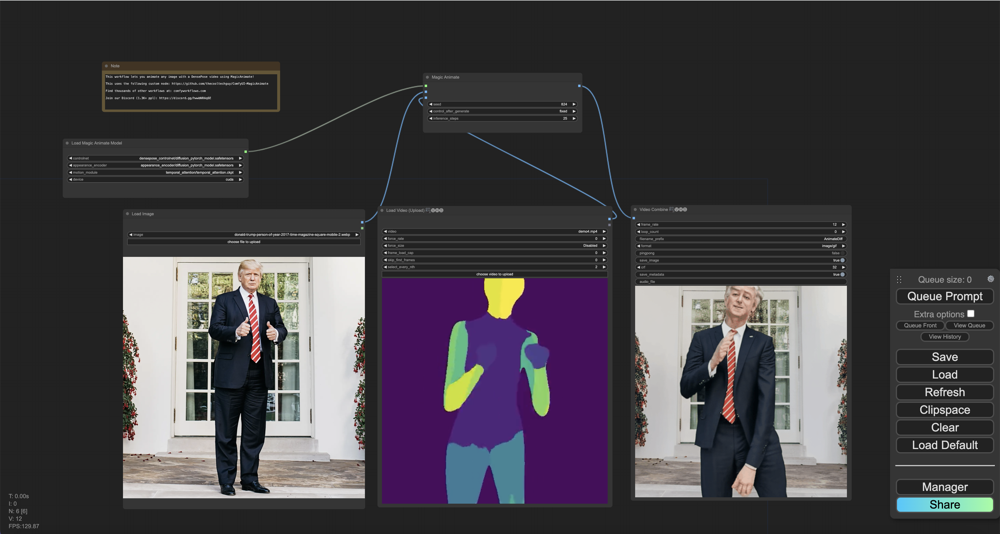

# ComfyUI-MagicAnimate
Easily use Magic Animate within ComfyUI!

[](https://discord.gg/MfVCahkc2y)

<!-- table of contents -->
- [Installation](#1-installation)
- [Node types](#node-types)
- [Example workflows](#example-workflows)
    - [Animate any person's image with a DeepPose video input](#animate-any-person's-image-with-a-DeepPose-video-input)
    <!-- - [Animate any person's image using pose extracted from any video input](#animate-any-person's-image-using-pose-extracted-from-any-video-input) -->

Need help? <a href="https://discord.gg/hwwbNRAq6E">Join our Discord!</a>

## Installation (this custom node will auto-download ~15GB of model weights!)
### Option 1: Automatic installation (Recommended)
Please install "ComfyUI-MagicAnimate" via the ComfyUI-Manager.

### Option 2: Manual installation
```
cd ComfyUI/custom_nodes/
git clone https://github.com/thecooltechguy/ComfyUI-MagicAnimate
cd ComfyUI-MagicAnimate/
python -m pip install -r requirements.txt
```

## Node types
- **MagicAnimateModelLoader**
    - Loads the MagicAnimate model
- **MagicAnimate**
    - Uses the MagicAnimate model to animate an input image using an input DeepPose video, and outputs the generated video

## Example workflows

### Animate any person's image with a DeepPose video input
[https://comfyworkflows.com/workflows/2e137168-91f7-414d-b3c6-23feaf704fdb](https://comfyworkflows.com/workflows/2e137168-91f7-414d-b3c6-23feaf704fdb)




## TODO
- [x] Fix white color in output (credits: [@mingqizhang](https://github.com/thecooltechguy/ComfyUI-MagicAnimate/pull/11))
- [x] Optimize amount of models downloaded (now requires 15GB and only downloads the models needed) 
- [ ] Refactor to use any Model, VAE, and ControlNet input from ComfyUI (this should also further reduce number of models downloaded)

<!-- ### Animate any person's image using pose extracted from any video input
[https://comfyworkflows.com/workflows/5a4cd9fd-9685-4985-adb8-7be84e8636ad](https://comfyworkflows.com/workflows/5a4cd9fd-9685-4985-adb8-7be84e8636ad)


 -->